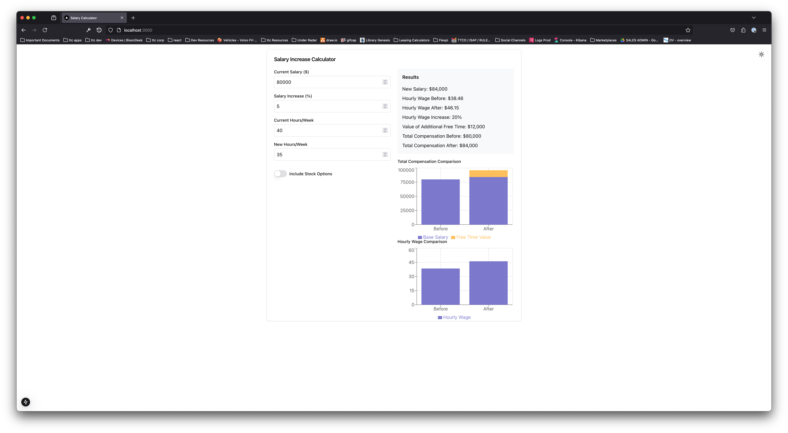

# Salary Calculator

A modern web application built with Next.js that helps professionals evaluate job offers and salary changes by considering multiple factors beyond just the base salary.

## 🎯 Purpose

This calculator was created to help people make more informed decisions about job offers and career moves by considering:

- Base salary changes
- Stock options valuation
- Work hours impact
- Hourly wage comparisons
- Value of free time
- Total compensation analysis

## 🚀 Features

- **Comprehensive Salary Analysis**

  - Input current salary and expected increase
  - Calculate new total compensation
  - Compare hourly wages before and after changes

- **Stock Options Evaluation**

  - Toggle stock options calculations
  - Input number of options and their value
  - See impact on total compensation

- **Work-Life Balance Consideration**

  - Input current and new weekly hours
  - Calculate the value of changes in free time
  - Visualize real hourly wage impact

- **Visual Data Representation**
  - Interactive charts showing compensation breakdown
  - Clear comparison between current and new situations
  - Visual representation of hourly wage changes

## 💻 Technical Stack

- **Framework**: Next.js 14 with App Router
- **Styling**: Tailwind CSS
- **Components**: Shadcn/UI
- **Charts**: Recharts
- **Language**: TypeScript

## 🎨 Preview



## 🛠️ Development

This is a personal project built to explore Next.js features and practice modern React patterns. Feel free to use it as inspiration for your own projects!

### Running Locally

```bash
git clone [your-repo-url]
cd salary-calculator
npm install
npm run dev
```

## 📝 License

MIT
